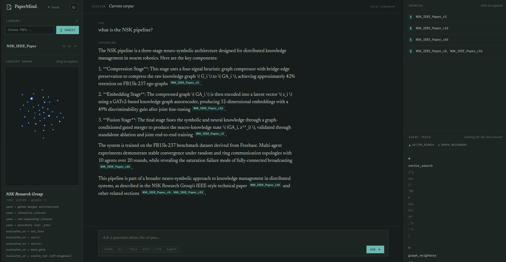
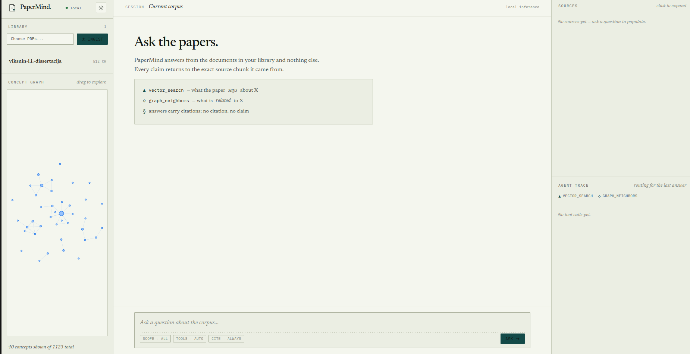

# PaperMind

> A local research assistant that answers questions about your papers — and cites every claim.


PaperMind ingests a folder of academic PDFs and lets you ask questions about them in plain language. Every answer is grounded in the documents you loaded and traced back to the exact source chunk it came from. It runs entirely on local hardware — no cloud APIs, no keys, no data leaving the machine.

---

## What makes it different

Most "chat with your PDFs" tools do one thing: semantic search. PaperMind does two, and lets an agent decide which to use.

- **`vector_search`** — semantic similarity. Answers *"what does the paper say about X?"*
- **`graph_neighbors`** — knowledge-graph traversal. Answers *"what is related to X?"*
- **`cite_source`** — fetches verbatim chunk text, so the agent can verify before answering.

A LangGraph ReAct agent reads each question, picks the appropriate tool (or both), and composes an answer where every factual sentence carries a citation. Ask a "what does it say" question and it reaches for vector search; ask a "what relates to what" question and it walks the knowledge graph. The routing is the point — it is a small demonstration of an agent reasoning about *how* to retrieve, not just retrieving.

## Screenshots



*A cited answer, the Sources panel, the Agent trace showing which tools were used, and a clickable knowledge-graph viewer.*



*Light theme. PaperMind follows the OS preference and has a manual toggle.*

## Architecture

PaperMind has two phases: an **offline ingestion pipeline** that runs once per corpus, and an **online query pipeline** that runs per question. They share the vector store and the knowledge graph.

### Ingestion (run once per corpus)
Each PDF is parsed and split into overlapping chunks. The chunks fork down two paths: one is embedded into a Chroma vector store; the other is processed by a local LLM that extracts entities and relations into a NetworkX knowledge graph. The graph is then resolved (duplicate nodes merged) and cleaned (formula and OCR-noise nodes dropped). The extraction job is resumable — it checkpoints progress and can be interrupted and restarted without losing work.

### Query (run per question)
The agent receives the question, selects and calls tools, optionally loops to retrieve more, and returns an answer grounded in chunk IDs. A FastAPI backend exposes this over HTTP; a vanilla HTML/CSS/JS frontend renders the chat, the citations, the agent trace, and a clickable force-directed view of the knowledge graph.

## Stack

| Layer | Choice |
|---|---|
| LLM | Qwen 2.5 7B (Q4), local via Ollama |
| Embeddings | `paraphrase-multilingual-MiniLM-L12-v2`, CPU |
| Vector store | Chroma (persistent, local) |
| Knowledge graph | NetworkX |
| Agent | LangGraph (ReAct) |
| Backend | FastAPI |
| Frontend | Vanilla HTML / CSS / JavaScript |

Everything is free and open-source. No API keys are required.

## Quickstart

**Prerequisites:** Python 3.11+, [Ollama](https://ollama.com).

```bash
# 1. Clone and install
git clone https://github.com/AliAlhasan6/papermind.git
cd papermind
python3 -m venv .venv && source .venv/bin/activate
pip install -r requirements.txt
pip install -e .

# 2. Pull the local model
ollama pull qwen2.5:7b-instruct-q4_K_M

# 3. Configure (defaults are sensible — no editing needed)
cp .env.example .env

# 4. Add PDFs and ingest them
cp /path/to/your/papers/*.pdf data/papers/
python -m papermind.ingest data/papers/

# 5. (Optional) Build the knowledge graph — enables graph_neighbors
python -m papermind.extract_all
python -m papermind.resolve
python -m papermind.clean_kg

# 6. Run
uvicorn papermind.api:app --port 8000
# open http://localhost:8000
```

Vector search works immediately after step 4. The knowledge-graph tool requires step 5, which calls the local LLM once per chunk — on modest hardware this is an overnight job for a large corpus, and it is resumable. PDFs can also be added and removed through the web UI.

## Design decisions

**Why fully local.** No API keys, no quotas, no data leaving the machine. The entire system — LLM, embeddings, vector store, knowledge graph — runs on commodity hardware (developed on a laptop with a 4 GB GPU). This makes it reproducible and suitable for privacy-sensitive corpora.

**Why hybrid retrieval.** Vector search is strong for semantic questions but weak for questions about *relationships* between concepts. Adding a knowledge-graph layer gives the agent a second mode of retrieval and a decision to make. The decision is the interesting part.

**Why a multilingual embedder.** The embedder was chosen so that English queries can retrieve relevant passages from a non-English corpus — cross-lingual retrieval from a single vector space.

**Why citations are mandatory.** The agent is instructed that an answer without chunk-ID citations is invalid. This is the enforcement mechanism for grounding: every claim must trace to a real chunk, and the UI lets you click any citation to read the verbatim source. The knowledge-graph viewer is likewise clickable — every node shows its neighbors, so the graph the agent traverses is inspectable.

## Limitations

PaperMind is an honest small system, not a polished product. Known limitations:

- **Knowledge-graph quality.** Entities and relations are extracted by a 7B local model. Roughly two-thirds to three-quarters of chunks yield usable extractions; relation types are approximate. The graph is best treated as a navigation aid, not a formal ontology.
- **Graph fragmentation.** Independent per-chunk extraction produces a fragmented graph. Entity resolution is currently string-level only. Semantic entity merging is future work.
- **Inference speed.** Local inference on a low-end GPU is slow — a single answer can take a few minutes. This is the deliberate cost of running fully offline.
- **Multilingual answers.** For a non-English corpus, answers are composed in English but source terms and entity names are preserved in their original language, since they are more precise and easier to verify against the source.

## Future work

- Semantic entity resolution (embed entity names, merge near-duplicates)
- Reranking after vector retrieval
- Word-document (`.docx`) ingestion
- A cloud-LLM configuration for a faster hosted demo
- An evaluation harness measuring retrieval recall and citation accuracy

## License

MIT — see [LICENSE](LICENSE).

Built by Alhasan Ali.
